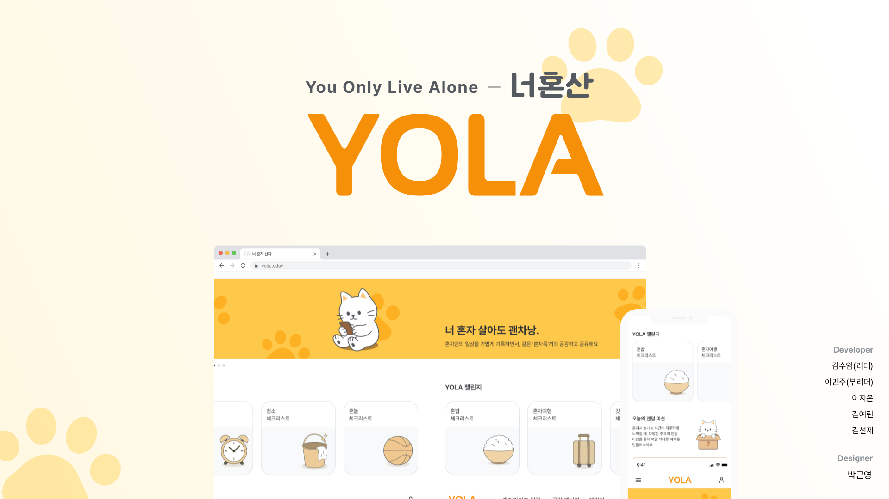
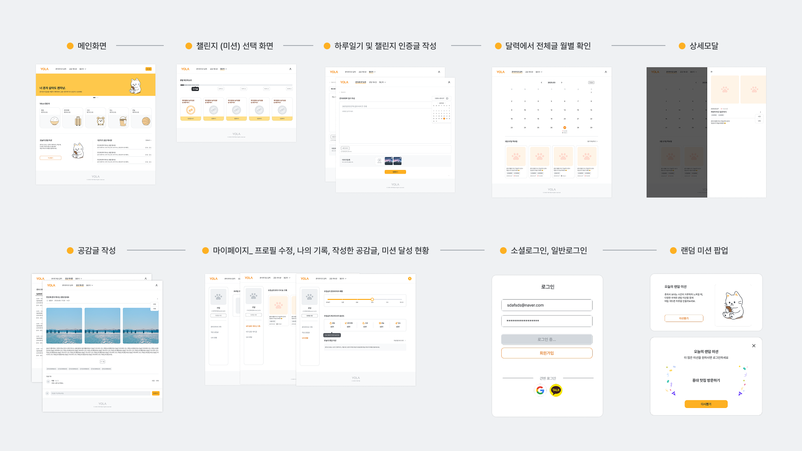
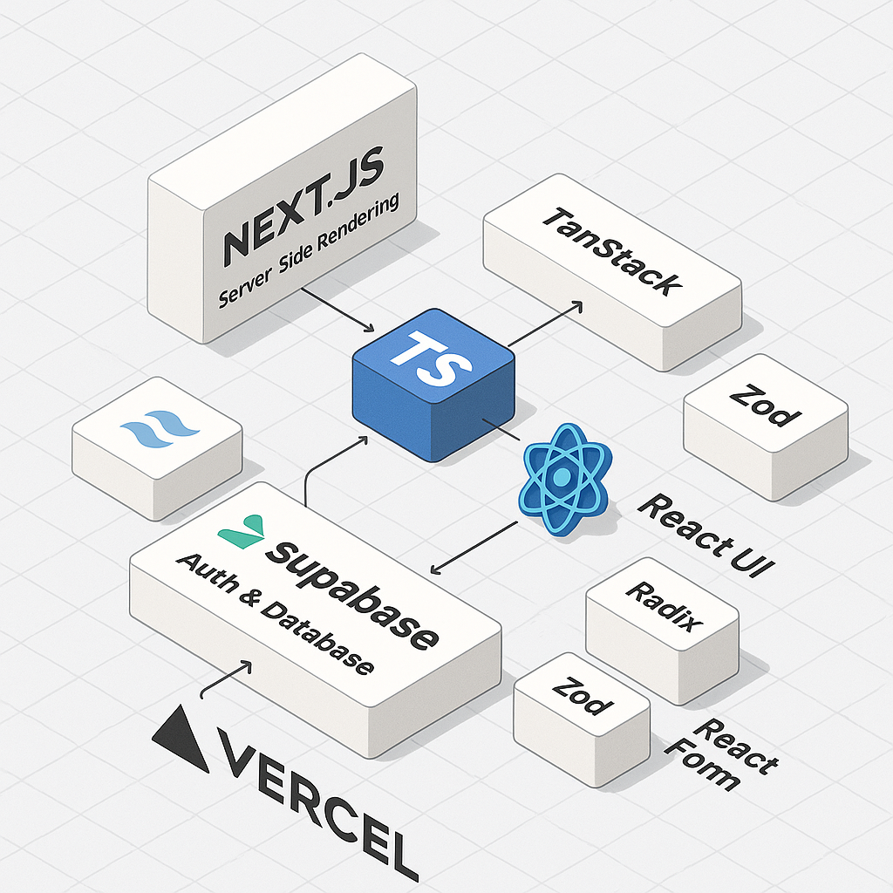
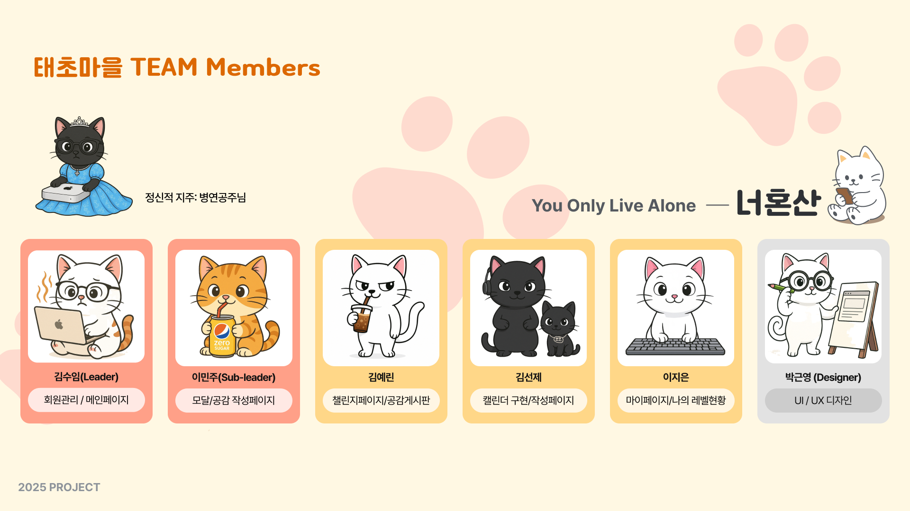

# 🐈 YOLA - 너 혼자 산다

> _"You Only Live Alone"_

혼자 보내는 일상을 공유하고 즐길 수 있는 서비스, YOLA!

</br>

## 🌐 서비스 기획 의도

- 1인 가구🧍‍♀️, 계속 늘고 있어요
  연령 불문, 혼자 사는 사람들이 많아졌습니다.

- 코로나 🦠 이후, 더 고립된 일상
  대면 접촉 감소, 사회적 단절,
  외로움이 일상이 되었습니다.

- 혼자 있는 시간 🕰, 어떻게 보내고 있나요?
  혼자여도 건강하게, 의미 있게
  보내고 싶은 사람들이 늘고 있어요.

- 그래서, 우리는 ✨YOLA✨를 만들었습니다.
  ‘혼자서도 잘 살아가는 사람들’을 위한
  소통과 공감의 공간입니다.

</br>

## 📒 YOLA에서 할 수 있는 것 (주요 기능)

- 챌린지: 다양한 데일리 체크리스트와 미션 인증을 통한 레벨 업 시스템
- 나만의 ‘혼자 라이프’ 기록: 하루 일기와 미션 인증을 한 눈에 확인하는 캘린더 뷰
- 공감 게시판: 카테고리별 주제로 다른 YOLA 유저들과 소통하는 공간
- 마이페이지: 챌린지 레벨, 공감 게시판 작성글 등 나의 YOLA 활동 기록을 확인
- 랜덤 미션 뽑기: 게임처럼 즐기는 엔터테인먼트 경험 제공

</br>

## 📌 프로젝트 기간

2025.03.28 - 2025.05.01 (35일)

</br>

## 🏗 시스템 아키텍쳐

- UI Flow
  

- System Architecture
  

</br>

## 📂 프로젝트 폴더 구조 및 구성 의도

🗂️ 프로젝트 폴더 구조

```📦 YOLA
├─ public // 정적 리소스(이미지)
├─ src
│  ├─ app              // app router
│  │  ├─ (auth)        // 회원관련 페이지(로그인, 회원가입, 마이페이지 등)
│  │  ├─ (checklist)   // 체크리스트(챌린지) 관련 페이지
│  │  ├─ (life)        // 혼자 라이프 기록(캘린더 / 작성) 관련 페이지
│  │  ├─ gonggam       // 공감 게시판 페이지
│  │  ├─ home          // home(메인) 페이지
│  │  ├─ error         // 별도의 error 페이지
│  │  ├─ api           // 서버리스 API(라우트 핸들러)
│  │  ├─ globals.css
│  │  ├─ error.tsx     // 전역 error 페이지
│  │  ├─ layout.tsx    // root layout
│  │  ├─ not-found.tsx // 404 not found 페이지
│  │  └─ page.tsx      // 루트 페이지(랜딩 페이지)
│  │
│  ├─ components       // 컴포넌트 구성
│  │  ├─ common        // 공통으로 사용하는 컴포넌트
│  │  ├─ features      // 도메인 별로 사용하는 컴포넌트
│  │  ├─ layout        // root layout 컴포넌트
│  │  └─ ui            // shadcn 컴포넌트
│  │
│  ├─ constants        // 상수
│  │
│  ├─ contexts         // context API
│  │
│  ├─ lib              // 유틸리티 및 라이브러리
│  │  ├─ hooks         // 커스텀 훅
│  │  ├─ providers     // 프로바이더(TQ)
│  │  └─ utils         // util 함수
│  │     ├─ api        // api 호출 함수
│  │     ├─ supabase   // supabase client
│  │     └─ validation // zod 스키마
│  ├─ middleware.ts
└─ └─ types            // 모듈화 타입
```

</br>

🤔 구성 의도

1️⃣ **도메인 중심 라우팅 (Feature-based Routing)**

- `src/app` 디렉토리 하위에 `auth`, `checklist`, `life`, `gonggam` 등 기능(도메인) 단위로 페이지를 분리하여 각 영역의 책임과 역할을 명확히 구분

- 이는 기능별 변경이나 확장에 유리, 협업 시 역할 분담을 쉽게 함

---

2️⃣ **관심사 분리 (Separation of Concerns)**

- `components`, `lib`, `contexts`, `constants`, `types` 등의 디렉토리를 통해 UI, 로직, 상태, 타입 정의 등 다양한 관심사를 분리

- 각각의 폴더는 명확한 역할을 가지고 있으며,다른 영역에 의존하지 않고 독립적으로 관리될 수 있도록 구성

---

3️⃣ **컴포넌트 설계 전략**

- `components/common`: 공통적으로 사용되는 범용 컴포넌트
- `components/features`: 특정 도메인에 종속적인 기능성 컴포넌트
- `components/layout`: 전체 페이지의 레이아웃 구성 요소
- `components/ui`: shadcn 기반의 UI 컴포넌트 모음

---

4️⃣ **유틸리티 및 서비스 모듈화**

- `lib/hooks`: 커스텀 훅 모음으로 비즈니스 로직의 재사용을 유도
- `lib/utils`: 공통 유틸 함수, API 호출, Supabase 클라이언트, Zod 스키마 등 기능별로 세분화

- `contexts`: React Context API 기반의 부분 전역 상태 및 기능 관리

---

5️⃣ **API 핸들러 및 서버리스 설계**

- `app/api`: Next.js의 serverless 기능을 활용하여 API를 구성

- 클라이언트와 분리된 BackEnd 기능을 담당

---

6️⃣ **에러 및 전역 처리**

- `error.tsx`, `not-found.tsx`, `middleware.ts` 등을 통해 에러 및 예외 상황에 대한 글로벌 핸들링을 처리

</br>

## 🛠 트러블슈팅

1. [드롭다운 메뉴 깜박임 해결하기](https://teamsparta.notion.site/1e52dc3ef51481ceb0f7cd3b7efa27ff)
2. [맥 태그 이슈](https://teamsparta.notion.site/1e52dc3ef51481ae8d3ddff51b251987)
3. [넌 객체를 보고 있지만 사실은 배열이었다(feat. TypeError)](https://teamsparta.notion.site/feat-TypeError-1e52dc3ef514810db84ec0fa3b86d170)
4. [캘린더 스와이핑 구현](https://teamsparta.notion.site/1e52dc3ef51481519e5ae2b176e2c833)
5. [마이페이지 레벨 시스템 구현](https://teamsparta.notion.site/1e52dc3ef51481a7bbeafdca9235a793)

</br>

## 🛠 기술 스택

|                                                            기술                                                             | 사용 목적              |
| :-------------------------------------------------------------------------------------------------------------------------: | ---------------------- |
|                       | UI 개발                |
|            | 타입스크립트           |
|  | 비동기 데이터 관리     |
|        | 전체 CSS 스타일링      |
|                  | 백엔드 및 데이터베이스 |
|                                              🛠 **Custom Hooks & Components**                                               | 코드 재사용성 향상     |

</br>

## 👥 팀원 소개

|   이름    | 역할     | 담당                       |
| :-------: | -------- | -------------------------- |
| 🌝 김수임 | 팀장     | 회원관리/ 메인페이지       |
| 🐣 이민주 | 부팀장   | 모달/ 공감 작성페이지      |
| 🥨 이지은 | 팀원     | 마이페이지/ 나의 레벨 현황 |
| 🍋 김예린 | 팀원     | 챌린지 페이지/ 공감 게시판 |
| 🐈‍⬛ 김선제 | 팀원     | 캘린더 구현/ 작성 페이지   |
| 🎨 박근영 | 디자이너 | 디자인 담당                |

팀 노션 바로가기 : 💫 [5조 - 태초마을](https://www.notion.so/teamsparta/5-1c32dc3ef51480ee8845d3df14798ee3)

</br>


